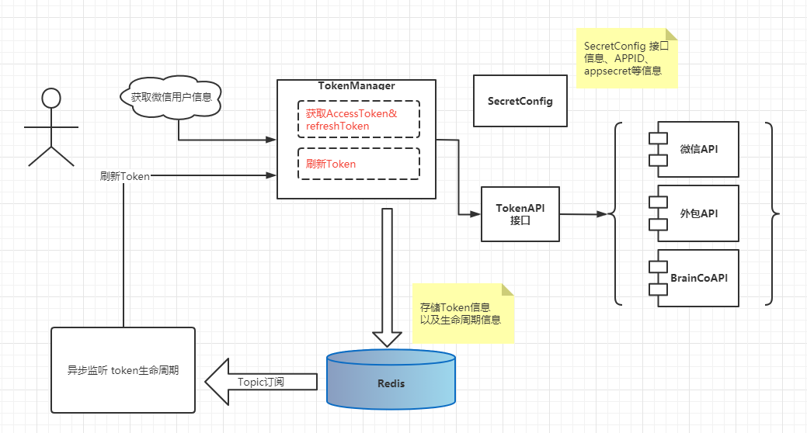

# TokenManager

TokenManager是一款基于Java开发的Springboot组件，用于管理自身平台以外的三方Token。

TokenManager将全场景的远程调用获取Token抽象到TokenManager接口中，通过调用指定的API实现各类三方系统的Token的管理。

通过Redis的消息订阅特性实现了延时消息监听Token生命周期过期时间，从而自动刷新Token。
确保在高并发请求下，用户不会调用具体的三方接口实时获取Token。

TokenManager原理图如下所示：



开发者：marker

### TokenManager特性

- **多环境Token共享**
  例如：调试微信，获取appid+secrt换取accessToken，在开发环境和测试环境共用appid的情况下，Token共享。

- **自动刷新accessToken**
  支持基于Oauth2协议的刷新Token机制，无需干预自动刷新，最佳的管理方式，提高接口响应速度。
  
- **多级缓存（待实现)**
  支持本地缓存与远程缓存。本地缓存JVM级别的，远程缓存基于Redis。提高Token的访问速度，防止Redis击穿雪崩。
  本地缓存的生命周期动态管理。

- **可扩展**
  支持扩展现有的API实现，能够支持除了微信以外的其他平台。采用自动装配技术，实例动态注入到Spring容器中。

- **支持请求日志拦截**
  通过RestTempalte 拦截器实现了请求日志拦截，默认实现了请求Slf4j的info级别日志。可以自定义配置个性化的拦截实现。
  
### 快速开始

准备好Redis-server，服务IP与端口还有密码

```
服务：127.0.0.1:6379
密码：123456
```

如果您没有Redis服务环境，推荐使用Docker部署测试。


在您的项目中pom.xml加入maven依赖：
```
<!-- 开发者：marker 三方Token管理器 -->
<dependency>
    <groupId>com.wuweibi</groupId>
    <artifactId>token-manager</artifactId>
    <version>0.0.1</version>
</dependency>
```  


### TokenAPI

TokenAPI 提供了获取Token和刷新token两种接口，参数包含SecretConfig和Map，这里使用Map的原因是我们不能确定获取Token需要c端用户传递哪些数据字段，因此使用Map会较为通用的方式。


TokenManager会通过类型自动判断调用那个接口实现，当然我们也可以采用策略模式直接设置TokenAPI到TokenManger实例里。


### Springboot配置内容

```
spring:
  ## 三方Token管理器
  token-manager:
    enabled: true
    # redis链接地址
    host: ${TOKEN_REDIS_HOST:192.168.1.6}
    # redis密码
    password : ${TOKEN_REDIS_PASSWORD:xxx}
    # redis数据索引 默认14
    database : ${TOKEN_REDIS_DB:13}
    port: ${TOKEN_REDIS_PORT:6379}
    lettuce:
      #在关闭客户端连接之前等待任务处理完成的最长时间，在这之后，无论任务是否执行完成，都会被执行器关闭，默认100ms
      shutdownTimeout: 100
      pool:
        # 连接池最大连接数（使用负值表示没有限制）
        maxActive: 50
        # 连接池中的最大空闲连接
        maxIdle: 10
        # 连接池中的最小空闲连接
        minIdle: 9
        # 连接池最大阻塞等待时间（使用负值表示没有限制）
        maxWait: -1
    # Token管理器多实例配置
    configMap:
      # 微信Token接口配置
      weixinMp:
        type: WEIXIN
        appid: wx03698c0a99f50cfb
        appsecret: 82aee19d923384fcda0be1ad9f23619c
        offsetTime: 60
```
